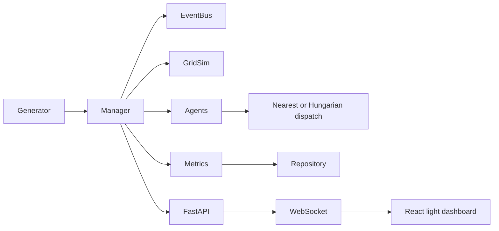

# Urban Emergency Response Simulation — Stage 1

Software-only seeded emergency-response simulation around a Pune-inspired grid. It runs offline with Python, SQLite, GridSim and an in-memory event bus; SUMO, Redis and PostGIS are optional adapters.

## Quick start

Install Python dependencies with `python -m pip install -e "backend[dev]"`, then run the API from `backend` using `python -m uvicorn app.main:app --reload`. In another terminal run `cd frontend; npm install; npm run dev`. Open <http://localhost:5173>. `make demo` starts both servers in hidden windows and opens the dashboard. `make install`, `make test`, `make lint`, `make experiment`, and `make demo` are provided for GNU Make environments. On Windows without Make, run `python scripts/demo.py`.

Docker Compose provides Redis, PostGIS, backend and frontend: `docker compose up --build`.

## Experiments

From `backend`, run `python -m experiments.run_experiment --strategy nearest --episodes 20 --seeds 1-20 --duration 3600 --rate 90 --out results/nearest.csv`. Rate is the mean interval in seconds between incidents. All episode randomness uses a generator initialized from each seed.

## UI Fix

GridSim now draws its roads and responder markers as SVG on a light surface, without real-world map tiles. The plain title and clock use no glow or animation, and `python scripts/check_design.py` enforces the palette, effects, and no-tile rule. Verify with `python scripts/demo.py` and run `python scripts/check_design.py`; GNU Make hosts can use `make demo` and `make lint`.

The live-map regression suite checks backend road topology and frontend SVG endpoints. Run `cd frontend; npx playwright install chromium; npm run test:e2e` to also verify 1280px/1920px horizontal overflow and refresh `docs/screenshots/map-fixed.png`; `make install` installs the browser needed by `make test`.

## Stage 2

Congestion-aware A* provides route ETA, distance, and turns. Choose a strategy for the next API/dashboard run with `DISPATCH_STRATEGY=nearest` (default) or `DISPATCH_STRATEGY=hungarian`; the dashboard selector is disabled while a run is active. Compare paired seeds with `cd backend; python -m experiments.run_experiment --compare --scenarios 5`. This writes a CSV and Markdown summary under `backend/experiments/results/`. GNU Make hosts can run `make experiment ARGS="--compare --scenarios 5"`.

## Adding strategies and roadmap

Implement `DispatchStrategy` in `app/strategies/` and add one constructor to `app/strategies/registry.py`. Stage 3: expose the environment as PettingZoo and train/evaluate MAPPO. Reinforcement learning and PettingZoo are out of scope for this stage.

## Stage 1 limits

SUMO is guarded but still follows GridSim behavior; no TraCI network integration was available to exercise. Redis Streams supports publish, consumer groups, drain and acknowledgement, but the current API runs agents inside the manager rather than as independent Redis worker processes. Hospital stays use a fixed five-minute duration. The GridSim dashboard requires no map tile access.
