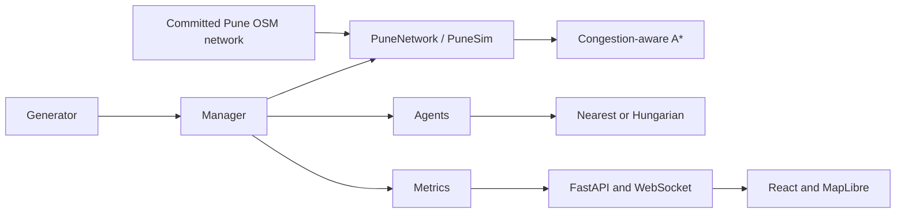

# Pune Emergency Response Simulation

A seeded emergency-response demo on a real OpenStreetMap road network for central Pune. The dashboard opens on a light MapLibre map with cached Pune roads and hospital, fire, and police facilities; start a run to see incidents, moving response units, routes, dispatch decisions, and metrics. CARTO light tiles provide optional map context; the roads remain visible when tile access is unavailable. The GridSim vector map is a developer/test mode only (`SIMULATION_MODE=gridsim`) and is not selectable in the public Pune dashboard.

## Requirements

- Python 3.11 or newer
- Node.js 20 or newer with npm
- Ports 8000 and 5173 available
- Internet for installing dependencies and optional CARTO tiles; the committed Pune network runs without downloading OSM again
- GNU Make and Docker are optional

## Share and run on another computer

Share a Git clone URL or a ZIP containing the source, `data/pune/network.json`, `data/pune/roads.geojson`, `backend/tests/fixtures/pune_mini.json`, and `frontend/package-lock.json`. Do not include virtual environments, `node_modules`, build output, or local `.env` files. Keep the three Pune data artifacts together in the repository so the demo works without Overpass access.

### Install on Windows (PowerShell)

From the repository folder:

```powershell
py -3.11 -m venv .venv
.\.venv\Scripts\Activate.ps1
python -m pip install --upgrade pip
python -m pip install -e "backend[dev]"
Set-Location frontend
npm ci
Set-Location ..
```

If virtual-environment activation is disabled, run `.\.venv\Scripts\python.exe -m pip install -e "backend[dev]"` and use that Python executable for backend commands. Install GNU Make (for example through MSYS2 or Chocolatey) to use the `make` commands below; equivalent Python/npm commands are shown where needed.

### Install on macOS or Linux

```sh
python3 -m venv .venv
source .venv/bin/activate
python -m pip install --upgrade pip
python -m pip install -e 'backend[dev]'
cd frontend && npm ci && cd ..
```

## How to run the demo

1. In the repository root, activate the Python environment and run `make pune-data` (or `python scripts/build_pune_network.py`); existing committed data is validated locally.
2. Run `make demo` (or `python scripts/demo.py`) to validate the data, start the Pune backend and frontend, and open the browser.
3. Open [http://localhost:5173](http://localhost:5173) if it did not open automatically; press **Start** to launch a run.
4. Choose a dispatch strategy and speed, and watch the real road routes, incidents, response units, and metrics update.
5. Press Ctrl+C in the demo terminal to stop both servers; use `docker compose up --build` for the containerized version.

Without GNU Make, replace `make pune-data` with `python scripts/build_pune_network.py` and `make demo` with `python scripts/demo.py`. The latter reports missing or invalid data and points to the build command.

### Run the servers manually

Terminal 1:

```powershell
Set-Location backend
python -m uvicorn app.main:app --reload --host 127.0.0.1 --port 8000
```

Terminal 2:

```powershell
Set-Location frontend
npm run dev -- --host 0.0.0.0
```

For a trusted local network demo, open `http://<host-LAN-IP>:5173` from a second computer and allow the frontend port through the host's private-network firewall. Both servers run on the host computer.

## Data, modes, and configuration

Pune is the backend default (`SIMULATION_MODE=pune`). `PUNE_DATA_DIR` may point to the data folder; relative values resolve from the repository root. Missing/corrupt Pune data makes health report an error and scenario data endpoints return HTTP 503; Pune never falls back to a synthetic grid. The frontend gets its active mode and strategy/speed options from `GET /scenario`. `VITE_BASEMAP=carto-light` enables CARTO tiles; set it to `none` for a plain light background with roads. GridSim is available to developers by starting the backend with `SIMULATION_MODE=gridsim`; its separate browser checks run with `npm run test:e2e:grid`.

The OSM builder uses Overpass endpoints and a cached OSM graph if one is available. It may add only disclosed synthetic facility locations at named Pune landmarks when OSM facility data falls below the minimum; road graphs are never fabricated. The outputs in `data/pune/` are meant to be committed and stay below 10 MB total. `make doctor` prints active mode, network/facility counts, data presence, and port status. To override local frontend options, copy `frontend/.env.example` to `frontend/.env`; the backend mode remains authoritative after `/scenario` loads.

## Checks and experiments

```powershell
make lint
make test
cd frontend
npm run test:e2e
npm run test:e2e:grid
cd ..
sh check-design.sh
```

Run the Pune paired comparison with `make compare-pune`. It writes `results/pune_compare.csv`, `results/pune_compare.md`, and `results/latest_comparison.json`; the dashboard refreshes the comparison panel from the latest JSON. To run containers, use `docker compose up --build` from the repository root; stop them with `docker compose down`.

## Architecture



Route traffic factors are simulated assumptions rather than measured live traffic. Facility capacity is synthetic and documented in `docs/DECISIONS.md`. SUMO, MAPPO, predictive hotspots, drones, and self-healing agents remain future or interface-level work.
