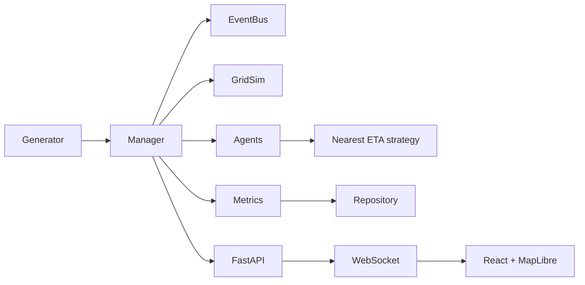

# Urban Emergency Response Simulation — Stage 1

Software-only seeded emergency-response simulation around a Pune-inspired grid. It runs offline with Python, SQLite, GridSim and an in-memory event bus; SUMO, Redis and PostGIS are optional adapters.

## Quick start

Install Python dependencies with `python -m pip install -e "backend[dev]"`, then run the API from `backend` using `python -m uvicorn app.main:app --reload`. In another terminal run `cd frontend; npm install; npm run dev`. Open <http://localhost:5173>. `make demo` starts both servers in hidden windows and opens the dashboard. `make install`, `make test`, `make lint`, `make experiment`, and `make demo` are provided for GNU Make environments. On Windows without Make, run `python scripts/demo.py`.

Docker Compose provides Redis, PostGIS, backend and frontend: `docker compose up --build`.

## Experiments

From `backend`, run `python -m experiments.run_experiment --strategy nearest --episodes 20 --seeds 1-20 --duration 3600 --rate 90 --out results/nearest.csv`. Rate is the mean interval in seconds between incidents. All episode randomness uses a generator initialized from each seed.

## Adding strategies and roadmap

Implement `DispatchStrategy` in `app/strategies/` and add one constructor to `app/strategies/registry.py`. Stage 2: implement A* path routing and Hungarian assignment against the same interfaces. Stage 3: expose the environment as PettingZoo and train/evaluate MAPPO. Reinforcement learning and PettingZoo are out of scope for this stage.

## Stage 1 limits

SUMO is guarded but still follows GridSim behavior; no TraCI network integration was available to exercise. Redis Streams supports publish, consumer groups, drain and acknowledgement, but the current API runs agents inside the manager rather than as independent Redis worker processes. Hospital stays use a fixed five-minute duration. The dashboard fetches public map tiles, so basemap detail needs network access even though the simulation itself does not.
