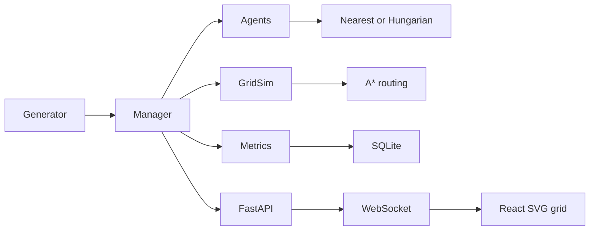

# Urban Emergency Response Simulation

A locally runnable, seeded urban emergency-response simulation. The backend runs a deterministic GridSim network with ambulance, fire, and police resources; the React dashboard displays the road grid, incidents, responders, dispatch decisions, and metrics. Stage 2 adds congestion-aware A* routing, nearest or Hungarian dispatch, and paired comparison experiments.

The GridSim network is drawn as an SVG vector grid and is shown as soon as the dashboard opens. It does not use map tiles. MapLibre is intentionally not used for this synthetic grid: real-world tiles would not match GridSim's roads. SUMO/TraCI is currently an adapter stub, not an active real-city map mode.

## Requirements

- Python 3.11 or newer
- Node.js 20 LTS or newer, with npm
- Git, to clone the project
- Ports `8000` and `5173` available on your computer

GNU Make and Docker are optional. No Redis, PostGIS, SUMO, MapLibre, or internet map service is needed for the default simulation. Internet access is needed to install packages on a new computer.

## Share the project

Push the source repository to a Git host and share its clone URL, or send a ZIP of the repository. Include source, `frontend/package-lock.json`, and `.env.example`. Do not include `.venv`, `node_modules`, `frontend/dist`, database files, or `.env` secrets; each person installs dependencies locally. A recipient can get the source with `git clone <repository-url>` followed by `cd Multi-Agent_EDI` (or the cloned folder's name), then follow the setup steps below.

## Install on Windows

Open PowerShell in the project folder:

```powershell
py -3 -m venv .venv
.\.venv\Scripts\Activate.ps1
python -m pip install --upgrade pip
python -m pip install -e "backend[dev]"
Set-Location frontend
npm ci
Set-Location ..
```

If PowerShell blocks virtual-environment activation, use `\.venv\Scripts\python.exe -m pip install -e "backend[dev]"` and invoke that Python executable for backend commands.

## Install on macOS or Linux

Open a terminal in the project folder:

```sh
python3 -m venv .venv
source .venv/bin/activate
python -m pip install --upgrade pip
python -m pip install -e "backend[dev]"
cd frontend
npm ci
cd ..
```

## Run the dashboard

Start the backend in one terminal:

```sh
cd backend
python -m uvicorn app.main:app --reload --host 127.0.0.1 --port 8000
```

Start the frontend in a second terminal:

```sh
cd frontend
npm run dev -- --host 127.0.0.1
```

Open [http://localhost:5173](http://localhost:5173). The vector street grid appears immediately; press **Start** to stream live units, incidents, traffic, and metrics. Press **Stop** before switching dispatch strategy. Both services run on your own computer.

For a one-command local demo, run `python scripts/demo.py` from the repository root. It starts both servers and opens the browser; press Ctrl+C in that terminal to stop them.

## Configuration

Defaults are offline-friendly: GridSim, SQLite, an in-memory event bus, and nearest-resource dispatch. To change settings, set environment variables before launching the backend, or copy `.env.example` to `backend/.env` and edit it. For example, set `DISPATCH_STRATEGY=hungarian` to make Hungarian the default for new runs. The dashboard also has a selector for the next run.

## Run tests and checks

```sh
cd backend
python -m ruff check app tests experiments
python -m pytest
cd ../frontend
npm run lint
npm test -- --run
npx playwright install chromium
npm run test:e2e
```

The Playwright check starts both services, verifies the live grid and no horizontal page overflow at 1280px and 1920px, then saves `docs/screenshots/map-fixed.png`. At the repository root, GNU Make users can run `make install`, `make test`, and `make lint`; `make install` also installs Playwright Chromium.

## Experiments

From `backend`, run the original nearest-resource batch:

```sh
python -m experiments.run_experiment --strategy nearest --episodes 20 --seeds 1-20 --duration 3600 --rate 90 --out results/nearest.csv
```

Compare both strategies over five paired seeds:

```sh
python -m experiments.run_experiment --compare --scenarios 5
```

The comparison CSV and Markdown report are saved under `backend/experiments/results/`. GNU Make users can pass the same options with `make experiment ARGS="--compare --scenarios 5"`.

## Architecture and limits



SUMO/TraCI is not a real runtime integration yet. Redis Streams is available as an optional event-bus adapter, while the default live API runs agents in the manager process. Hospital stays use a fixed five-minute duration. MAPPO, predictive hotspots, drones, and self-healing agents are future work.
