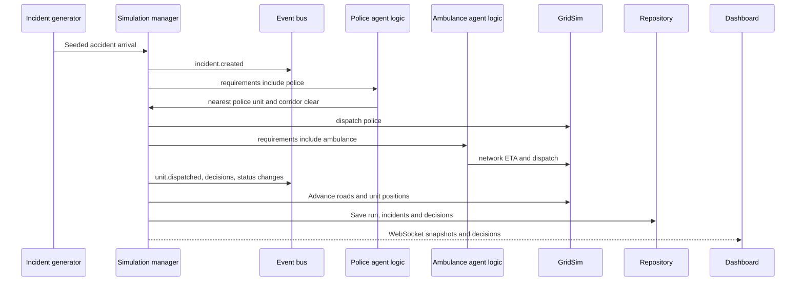

# Architecture

## Event flow for an accident

The manager runs the deterministic seeded tick loop. Incident requirements select the relevant resource kinds. Each kind uses the replaceable `DispatchStrategy` interface; the default computes Dijkstra travel-time ETAs and stores every idle candidate. A police unit's en-route state marks the corridor as clear, which affects emergency ETA calculations while active. Units transition through travel, on-scene service, optional injured-patient hospital transport, and return. Hospital bed and ICU capacity is reserved at transport and released after a fixed five-minute stay. The bus offers the same publish/subscribe/drain interface for in-memory and Redis Streams transports.

FastAPI exposes run controls, metrics, decisions, and WebSocket snapshots. SQLAlchemy stores completed runs and their incident/dispatch JSON payloads. The React dashboard applies snapshot/decision messages through a small reducer.
